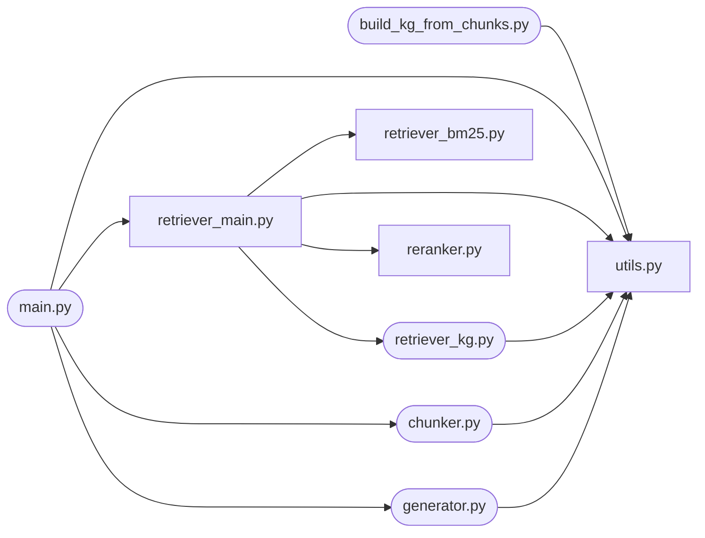

# Code Flow Analysis Report

**Source Directory**: `/tmp2/cctsai/project/RAG/src`  
**Files Analyzed**: 9  
**Entry Point(s)**: `build_kg_from_chunks.py`, `chunker.py`, `generator.py`, `main.py`, `retriever_kg.py`  

---

## Project Overview

| File | Functions | Classes | Entry Point | Description |
|------|:---------:|:-------:|:-----------:|-------------|
| `build_kg_from_chunks.py` | 5 | 0 | ✅ | Build nano-graphrag KG using pre-cached contextual chunks. |
| `chunker.py` | 6 | 0 | ✅ | — |
| `generator.py` | 7 | 0 | ✅ | — |
| `main.py` | 1 | 0 | ✅ | — |
| `reranker.py` | 0 | 1 |  | Cross-encoder Reranker using sentence-transformers. |
| `retriever_bm25.py` | 0 | 1 |  | Pyserini BM25 Retriever wrapped as LlamaIndex BaseRetriever. |
| `retriever_kg.py` | 6 | 1 | ✅ | Knowledge Graph Retriever using nano-graphrag. |
| `retriever_main.py` | 2 | 1 |  | Hybrid Retriever using LlamaIndex with Ollama embeddings (fully offline). |
| `utils.py` | 3 | 0 |  | — |

## Module Dependency Graph

## Function Call Flow

```mermaid
flowchart TD
    subgraph build_kg_from_chunks["build_kg_from_chunks.py"]
        build_kg_from_chunks__ollama_llm_func["ollama_llm_func()"]
        build_kg_from_chunks__ollama_embedding_func["ollama_embedding_func()"]
        build_kg_from_chunks__load_cached_chunks["load_cached_chunks()"]
        build_kg_from_chunks__load_merged_chunks["load_merged_chunks()"]
        build_kg_from_chunks__main[["🚀 main()"]]
    end
    subgraph chunker["chunker.py"]
        chunker___get_sliding_window["_get_sliding_window()"]
        chunker___extract_subject_name["_extract_subject_name()"]
        chunker___generate_chunk_context["_generate_chunk_context()"]
        chunker___rewrite_chunk_with_subjects["_rewrite_chunk_with_subjects()"]
        chunker__main_summarize["main_summarize()"]
        chunker__recursive_chunk[["🚀 recursive_chunk()"]]
    end
    subgraph generator["generator.py"]
        generator__judge_relevance["judge_relevance()"]
        generator___domain_router_en["_domain_router_en()"]
        generator___domain_router_zh["_domain_router_zh()"]
        generator__domain_router["domain_router()"]
        generator___get_domain_prompt_en["_get_domain_prompt_en()"]
        generator___get_domain_prompt_zh["_get_domain_prompt_zh()"]
        generator__generate_answer[["🚀 generate_answer()"]]
    end
    subgraph main["main.py"]
        main__main[["🚀 main()"]]
    end
    subgraph reranker["reranker.py"]
        subgraph reranker_Reranker["Reranker"]
            reranker__Reranker____init__["Reranker.__init__()"]
            reranker__Reranker__rerank["Reranker.rerank()"]
        end
    end
    subgraph retriever_bm25["retriever_bm25.py"]
        subgraph retriever_bm25_PyseriniBM25Retriever["PyseriniBM25Retriever"]
            retriever_bm25__PyseriniBM25Retriever____init__["PyseriniBM25Retriever.__init__()"]
            retriever_bm25__PyseriniBM25Retriever___build_index["PyseriniBM25Retriever._build_index()"]
            retriever_bm25__PyseriniBM25Retriever___rebuild_node_dict["PyseriniBM25Retriever._rebuild_node_dict()"]
            retriever_bm25__PyseriniBM25Retriever___retrieve["PyseriniBM25Retriever._retrieve()"]
            retriever_bm25__PyseriniBM25Retriever____del__["PyseriniBM25Retriever.__del__()"]
            retriever_bm25__PyseriniBM25Retriever__from_defaults["PyseriniBM25Retriever.from_defaults()"]
        end
    end
    subgraph retriever_kg["retriever_kg.py"]
        retriever_kg__ollama_llm_func["ollama_llm_func()"]
        retriever_kg__ollama_embedding_func["ollama_embedding_func()"]
        retriever_kg___safe_float["_safe_float()"]
        retriever_kg___parse_csv_section["_parse_csv_section()"]
        retriever_kg___parse_structured_context["_parse_structured_context()"]
        retriever_kg__create_kg_retriever[["🚀 create_kg_retriever()"]]
        subgraph retriever_kg_KGRetriever["KGRetriever"]
            retriever_kg__KGRetriever____init__["KGRetriever.__init__()"]
            retriever_kg__KGRetriever__retrieve_structured["KGRetriever.retrieve_structured()"]
            retriever_kg__KGRetriever___empty_result["KGRetriever._empty_result()"]
            retriever_kg__KGRetriever__retrieve["KGRetriever.retrieve()"]
            retriever_kg__KGRetriever__retrieve_local["KGRetriever.retrieve_local()"]
            retriever_kg__KGRetriever__retrieve_global["KGRetriever.retrieve_global()"]
        end
    end
    subgraph retriever_main["retriever_main.py"]
        retriever_main__create_retriever["create_retriever()"]
        retriever_main__create_kg_retriever["create_kg_retriever()"]
        subgraph retriever_main_Retriever["Retriever"]
            retriever_main__Retriever____init__["Retriever.__init__()"]
            retriever_main__Retriever__retrieve["Retriever.retrieve()"]
        end
    end
    subgraph utils["utils.py"]
        utils__load_jsonl["load_jsonl()"]
        utils__save_jsonl["save_jsonl()"]
        utils__load_ollama_config["load_ollama_config()"]
    end
    build_kg_from_chunks__main --> build_kg_from_chunks__load_merged_chunks
    build_kg_from_chunks__main --> build_kg_from_chunks__load_cached_chunks
    chunker___generate_chunk_context --> utils__load_ollama_config
    chunker___generate_chunk_context --> chunker___get_sliding_window
    chunker___generate_chunk_context --> chunker___extract_subject_name
    chunker___rewrite_chunk_with_subjects --> utils__load_ollama_config
    chunker___rewrite_chunk_with_subjects --> chunker___get_sliding_window
    chunker___rewrite_chunk_with_subjects --> chunker___extract_subject_name
    chunker__main_summarize --> utils__load_ollama_config
    chunker__main_summarize --> chunker___extract_subject_name
    chunker__recursive_chunk --> chunker___generate_chunk_context
    chunker__recursive_chunk --> chunker___rewrite_chunk_with_subjects
    generator__judge_relevance --> utils__load_ollama_config
    generator___domain_router_en --> utils__load_ollama_config
    generator___domain_router_zh --> utils__load_ollama_config
    generator__domain_router --> generator___domain_router_zh
    generator__domain_router --> generator___domain_router_en
    generator__generate_answer --> generator__domain_router
    generator__generate_answer --> generator___get_domain_prompt_en
    generator__generate_answer --> generator___get_domain_prompt_zh
    generator__generate_answer --> utils__load_ollama_config
    main__main --> utils__load_jsonl
    main__main --> chunker__recursive_chunk
    main__main --> retriever_main__create_retriever
    main__main --> retriever_kg__KGRetriever__retrieve
    main__main --> generator__generate_answer
    main__main --> utils__save_jsonl
    retriever_bm25__PyseriniBM25Retriever____init__ --> reranker__Reranker____init__
    retriever_bm25__PyseriniBM25Retriever____init__ --> retriever_bm25__PyseriniBM25Retriever___build_index
    retriever_bm25__PyseriniBM25Retriever___build_index --> retriever_bm25__PyseriniBM25Retriever___rebuild_node_dict
    retriever_kg___parse_structured_context --> retriever_kg___parse_csv_section
    retriever_kg___parse_structured_context --> retriever_kg___safe_float
    retriever_kg__KGRetriever__retrieve_structured --> retriever_kg__KGRetriever___empty_result
    retriever_kg__KGRetriever__retrieve_structured --> retriever_kg___parse_structured_context
    retriever_kg__KGRetriever__retrieve_local --> retriever_kg__KGRetriever__retrieve_structured
    retriever_kg__KGRetriever__retrieve_global --> retriever_kg__KGRetriever__retrieve
    retriever_main__Retriever____init__ --> utils__load_ollama_config
    retriever_main__Retriever____init__ --> retriever_bm25__PyseriniBM25Retriever__from_defaults
    retriever_main__Retriever____init__ --> retriever_main__create_kg_retriever
    retriever_main__Retriever__retrieve --> retriever_kg__KGRetriever__retrieve_local
    retriever_main__Retriever__retrieve --> retriever_kg__KGRetriever__retrieve
    retriever_main__Retriever__retrieve --> reranker__Reranker__rerank
```

## File Details

### `build_kg_from_chunks.py`

> Build nano-graphrag KG using pre-cached contextual chunks.

**Local Imports**: `utils`

**Functions:**

| Function | Line | Calls | Description |
|----------|:----:|-------|-------------|
| `ollama_llm_func` | 157 | `messages.append`, `messages.extend`, `messages.append`, `prompt.lower`, `prompt.lower`, `prompt.lower`, `ollama.Client`, `client.chat` | Custom LLM function using Ollama. |
| `ollama_embedding_func` | 181 | `ollama.Client`, `client.embeddings`, `embeddings.append`, `np.array` | Custom embedding function using Ollama. |
| `load_cached_chunks` | 193 | `open`, `json.load`, `chunk.get`, `meta.get`, `meta.get`, `documents.append`, `print`, `len` | Load pre-cached chunks. |
| `load_merged_chunks` | 245 | `open`, `json.load`, `defaultdict`, `get`, `chunk.get`, `get`, `chunk.get`, `append` +13 more | Load chunks and merge N adjacent chunks per doc_id with slid |
| `main` 🚀 | 284 | `print`, `print`, `print`, `language.upper`, `print`, `print`, `EmbeddingFunc`, `GraphRAG` +14 more | Main function to build/query the KG from cached chunks. |

### `chunker.py`

**Local Imports**: `utils`, `utils`

**Functions:**

| Function | Line | Calls | Description |
|----------|:----:|-------|-------------|
| `_get_sliding_window` | 9 | `doc_text.find`, `max`, `len`, `max`, `min`, `len`, `len` | Get a sliding window of surrounding context centered on the  |
| `_extract_subject_name` | 19 |  | Extract the primary subject name from metadata. |
| `_generate_chunk_context` | 28 | `load_ollama_config`, `Client`, `_get_sliding_window`, `_extract_subject_name`, `client.generate`, `strip`, `print` | Generate contextual description for a specific chunk using O |
| `_rewrite_chunk_with_subjects` | 113 | `load_ollama_config`, `Client`, `_get_sliding_window`, `_extract_subject_name`, `client.generate`, `strip`, `len`, `len` +6 more | Rewrite a chunk in-place by replacing all pronouns and ambig |
| `main_summarize` | 198 | `load_ollama_config`, `Client`, `_extract_subject_name`, `client.generate`, `strip`, `print` | Generate a high-level summary for the entire document using  |
| `recursive_chunk` 🚀 | 268 | `print`, `os.path.exists`, `open`, `json.load`, `print`, `RecursiveCharacterTextSplitter`, `RecursiveCharacterTextSplitter`, `isinstance` +26 more | Split documents into chunks using recursive character splitt |

### `generator.py`

**Local Imports**: `utils`

**Functions:**

| Function | Line | Calls | Description |
|----------|:----:|-------|-------------|
| `judge_relevance` | 6 | `load_ollama_config`, `Client`, `client.generate`, `lower`, `strip`, `any` | Use LLM to judge if a chunk is relevant to the query. |
| `_domain_router_en` | 47 | `load_ollama_config`, `Client`, `client.generate`, `upper`, `strip`, `print` | Classify the domain of the query based on query and context  |
| `_domain_router_zh` | 92 | `load_ollama_config`, `Client`, `client.generate`, `upper`, `strip`, `print` | Classify the domain of the query based on query and context  |
| `domain_router` | 137 | `_domain_router_zh`, `_domain_router_en` | Classify the domain of the query based on query and context. |
| `_get_domain_prompt_en` | 154 |  | Get English prompt based on domain. |
| `_get_domain_prompt_zh` | 344 |  | Get Chinese prompt based on domain. |
| `generate_answer` 🚀 | 533 | `enumerate`, `get`, `chunk.get`, `kg_structured_parts.append`, `kg_structured_parts.append`, `formatted_context.append`, `get`, `get` +13 more | — |

### `main.py`

**Local Imports**: `utils`, `retriever_main`, `chunker`, `generator`

**Functions:**

| Function | Line | Calls | Description |
|----------|:----:|-------|-------------|
| `main` 🚀 | 10 | `print`, `load_jsonl`, `load_jsonl`, `print`, `len`, `print`, `len`, `print` +22 more | Main RAG pipeline with configurable retrieval mode. |

### `reranker.py`

> Cross-encoder Reranker using sentence-transformers.

**Class `Reranker`** (line 10)

| Method | Line | Calls |
|--------|:----:|-------|
| `__init__` | 11 | `CrossEncoder`, `print` |
| `rerank` | 23 | `node.node.get_content`, `self.model.predict`, `enumerate`, `NodeWithScore`, `float`, `scored_nodes.append` +1 more |

### `retriever_bm25.py`

> Pyserini BM25 Retriever wrapped as LlamaIndex BaseRetriever.

**Class `PyseriniBM25Retriever` (BaseRetriever)** (line 17)

> A LlamaIndex-compatible retriever that uses Pyserini's BM25 implementation.

| Method | Line | Calls |
|--------|:----:|-------|
| `__init__` | 26 | `__init__`, `super`, `self._build_index`, `self._searcher.set_bm25`, `self._searcher.set_language` |
| `_build_index` | 70 | `os.path.exists`, `print`, `LuceneSearcher`, `self._rebuild_node_dict`, `len`, `tempfile.mkdtemp` +18 more |
| `_rebuild_node_dict` | 150 | `range`, `searcher.doc`, `doc.raw`, `json.loads`, `outer_data.get`, `json.loads` +5 more |
| `_retrieve` | 181 | `self._searcher.search`, `results.append`, `NodeWithScore`, `self._searcher.doc`, `doc.raw`, `json.loads` +9 more |
| `__del__` | 244 | `hasattr`, `os.path.exists`, `shutil.rmtree` |
| `from_defaults` | 250 | `cls` |

### `retriever_kg.py`

> Knowledge Graph Retriever using nano-graphrag.

**Local Imports**: `utils`

**Functions:**

| Function | Line | Calls | Description |
|----------|:----:|-------|-------------|
| `ollama_llm_func` | 29 | `messages.append`, `messages.extend`, `messages.append`, `prompt.lower`, `prompt.lower`, `prompt.lower`, `ollama.Client`, `client.chat` | Custom LLM function using Ollama. |
| `ollama_embedding_func` | 59 | `ollama.Client`, `client.embeddings`, `embeddings.append`, `np.array` | Custom embedding function using Ollama. |
| `_safe_float` | 72 | `float` | Safely convert a value to float, returning default on failur |
| `_parse_csv_section` | 80 | `csv_text.strip`, `csv_text.replace`, `re.sub`, `csv_text.replace`, `csv.DictReader`, `io.StringIO`, `row.items`, `strip` +2 more | Parse a CSV section into a list of dicts. |
| `_parse_structured_context` | 120 | `re.findall`, `section_name.lower`, `_parse_csv_section`, `sections.get`, `entities.append`, `strip`, `row.get`, `row.get` +18 more | Parse nano-graphrag's structured context output into compone |
| `create_kg_retriever` 🚀 | 361 | `KGRetriever` | Factory function to create KG Retriever. |

**Class `KGRetriever`** (line 188)

> Knowledge Graph Retriever using nano-graphrag.

| Method | Line | Calls |
|--------|:----:|-------|
| `__init__` | 191 | `os.path.dirname`, `os.path.abspath`, `os.path.dirname`, `os.path.join`, `os.path.join`, `os.path.exists` +6 more |
| `retrieve_structured` | 243 | `self.graph_rag.query`, `QueryParam`, `print`, `self._empty_result`, `_parse_structured_context`, `structured_lines.append` +12 more |
| `_empty_result` | 313 |  |
| `retrieve` | 328 | `self.graph_rag.query`, `QueryParam`, `print`, `str` |
| `retrieve_local` | 352 | `self.retrieve_structured` |
| `retrieve_global` | 356 | `self.retrieve` |

### `retriever_main.py`

> Hybrid Retriever using LlamaIndex with Ollama embeddings (fully offline).

**Local Imports**: `retriever_bm25`, `utils`, `reranker`, `retriever_kg`

**Functions:**

| Function | Line | Calls | Description |
|----------|:----:|-------|-------------|
| `create_retriever` | 246 | `Retriever` | Factory function to create a configured Retriever. |
| `create_kg_retriever` | 261 | `KGRetriever` | Factory function to create a KG Retriever. |

**Class `Retriever`** (line 23)

| Method | Line | Calls |
|--------|:----:|-------|
| `__init__` | 24 | `TextNode`, `c.get`, `enumerate`, `OllamaEmbedding`, `load_ollama_config`, `OllamaEmbedding` +24 more |
| `retrieve` | 121 | `self.kg_retriever.retrieve_local`, `kg_result.get`, `enumerate`, `kg_result.get`, `results.append`, `kg_result.get` +29 more |

### `utils.py`

**Functions:**

| Function | Line | Calls | Description |
|----------|:----:|-------|-------------|
| `load_jsonl` | 5 | `jsonlines.open`, `docs.append` | — |
| `save_jsonl` | 12 | `jsonlines.open`, `writer.write` | — |
| `load_ollama_config` | 17 | `Path`, `path.exists`, `FileNotFoundError`, `open`, `yaml.safe_load` | — |
